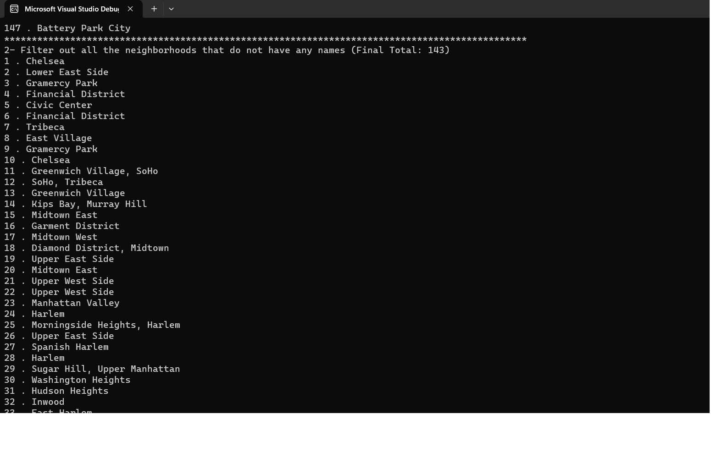

# Lab 09: LINQ in Manhattan

## Descreption

In this console application, I have deserializes the json to the data, and then use LINQ Query statements and LINQ method then prints the requested data to the console.library by the user.

## How it work

In this application, we were able to access the data in the Johnson file, which contains data about the Manhattan boroughs, where we can access it, sort it, and classify it using LINQ Query and LINQ method, where any programmer can now add the LINQ  to get his own results.

## Visual

 1- Output all of the neighborhoods in this data list(Final Total: 147 neighborhoods).

 2- Filter out all the neighborhoods that do not have any names (Final Total: 143).

 3- Remove the duplicates (Final Total: 39 neighborhoods).

 4- Rewrite the queries from above and consolidate all into one single query.

 5- Rewrite questions 4 only using the opposing method.

